# Architecture Documentation - Walkthru Website

**Last Updated:** November 15, 2025
**Project:** Walkthru - People-First Urban Intelligence Platform
**Architecture Pattern:** JAMstack with Next.js App Router

---

## Table of Contents

1. [System Architecture Overview](#system-architecture-overview)
2. [Application Structure](#application-structure)
3. [Component Hierarchy](#component-hierarchy)
4. [Data Flow Architecture](#data-flow-architecture)
5. [Theme System Architecture](#theme-system-architecture)
6. [Animation Pipeline](#animation-pipeline)
7. [Deployment Architecture](#deployment-architecture)
8. [Security Architecture](#security-architecture)

---

## System Architecture Overview

### High-Level Architecture

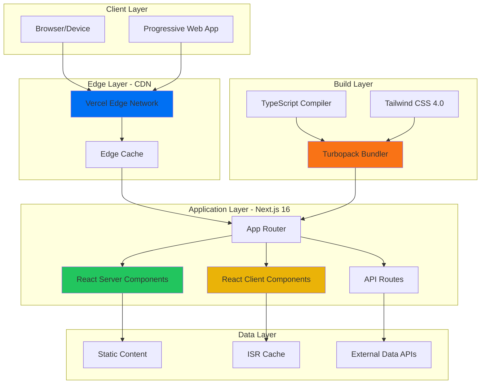
```mermaid
graph TB
    subgraph "Client Layer"
        Browser[Browser/Device]
        PWA[Progressive Web App]
    end

    subgraph "Edge Layer - CDN"
        Edge[Vercel Edge Network]
        Cache[Edge Cache]
    end

    subgraph "Application Layer - Next.js 16"
        AppRouter[App Router]
        RSC[React Server Components]
        RCC[React Client Components]
        API[API Routes]
    end

    subgraph "Data Layer"
        StaticData[Static Content]
        ISR[ISR Cache]
        ExternalAPI[External Data APIs]
    end

    subgraph "Build Layer"
        Turbopack[Turbopack Bundler]
        TypeScript[TypeScript Compiler]
        Tailwind[Tailwind CSS 4.0]
    end

    Browser --> Edge
    PWA --> Edge
    Edge --> Cache
    Cache --> AppRouter
    AppRouter --> RSC
    AppRouter --> RCC
    AppRouter --> API
    RSC --> StaticData
    RCC --> ISR
    API --> ExternalAPI

    Turbopack --> AppRouter
    TypeScript --> Turbopack
    Tailwind --> Turbopack

    style Edge fill:#0070f3
    style Turbopack fill:#f97316
    style RSC fill:#22c55e
    style RCC fill:#eab308
```

### Technology Stack Layers

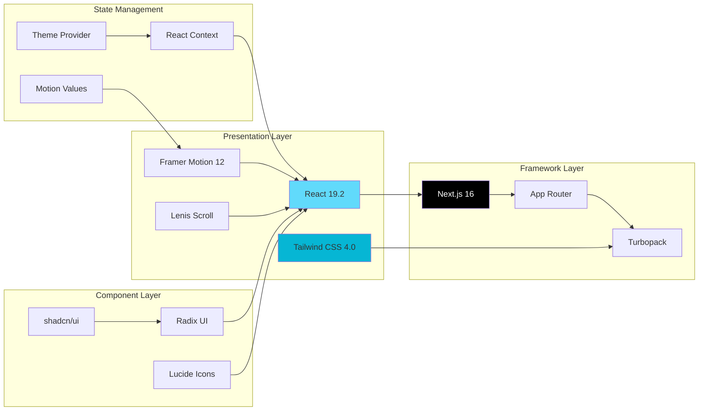
```mermaid
graph LR
    subgraph "Presentation Layer"
        A[React 19.2]
        B[Tailwind CSS 4.0]
        C[Framer Motion 12]
        D[Lenis Scroll]
    end

    subgraph "Framework Layer"
        E[Next.js 16]
        F[App Router]
        G[Turbopack]
    end

    subgraph "Component Layer"
        H[shadcn/ui]
        I[Radix UI]
        J[Lucide Icons]
    end

    subgraph "State Management"
        K[React Context]
        L[Theme Provider]
        M[Motion Values]
    end

    A --> E
    B --> G
    C --> A
    D --> A
    E --> F
    F --> G
    H --> I
    I --> A
    J --> A
    K --> A
    L --> K
    M --> C

    style E fill:#000000,color:#ffffff
    style B fill:#06b6d4
    style A fill:#61dafb
```

---

## Application Structure

### File System Architecture


```mermaid
graph TD
    Root[walkthru/]

    Root --> App[app/]
    Root --> Components[components/]
    Root --> Lib[lib/]
    Root --> Public[public/]
    Root --> Styles[styles/]
    Root --> Config[Configuration Files]

    App --> Layout[layout.tsx]
    App --> Page[page.tsx]
    App --> Fonts[fonts.ts]
    App --> Globals[globals.css]
    App --> APIRoutes[api/]

    Components --> UI[ui/]
    Components --> Sections[sections/]
    Components --> Animations[animations/]
    Components --> Theme[theme/]

    UI --> ShadcnComponents[shadcn components]

    Sections --> Hero[hero.tsx]
    Sections --> PatternDetection[pattern-detection.tsx]
    Sections --> Indices[indices.tsx]
    Sections --> LiveabilityGrid[livability-grid.tsx]
    Sections --> Vision[vision.tsx]
    Sections --> Footer[footer.tsx]

    Animations --> ScrollProgress[scroll-progress.tsx]
    Animations --> FadeIn[fade-in.tsx]
    Animations --> Parallax[parallax.tsx]

    Theme --> ThemeProvider[theme-provider.tsx]
    Theme --> ThemeToggle[theme-toggle.tsx]

    Lib --> Utils[utils.ts]
    Lib --> Constants[constants.ts]
    Lib --> Hooks[hooks/]

    Public --> Assets[assets/]
    Public --> Images[images/]
    Public --> Icons[icons/]

    Config --> NextConfig[next.config.mjs]
    Config --> TailwindConfig[tailwind.config.ts]
    Config --> TSConfig[tsconfig.json]

    style App fill:#0070f3
    style Components fill:#22c55e
    style Lib fill:#eab308
    style Public fill:#ef4444
```

### Detailed Directory Structure

```
walkthru/
├── app/
│   ├── layout.tsx              # Root layout with providers
│   ├── page.tsx                # Homepage
│   ├── fonts.ts                # Quicksand font configuration
│   ├── globals.css             # Global styles + Tailwind
│   ├── not-found.tsx           # 404 page
│   ├── error.tsx               # Error boundary
│   ├── loading.tsx             # Loading states
│   │
│   ├── api/                    # API routes
│   │   ├── cache/
│   │   │   └── route.ts        # Cache component API
│   │   └── health/
│   │       └── route.ts        # Health check endpoint
│   │
│   └── (marketing)/            # Route group for marketing pages
│       ├── about/
│       │   └── page.tsx
│       └── contact/
│           └── page.tsx
│
├── components/
│   ├── ui/                     # shadcn/ui components
│   │   ├── button.tsx
│   │   ├── card.tsx
│   │   ├── dropdown-menu.tsx
│   │   ├── navigation-menu.tsx
│   │   ├── scroll-area.tsx
│   │   ├── tabs.tsx
│   │   ├── badge.tsx
│   │   └── separator.tsx
│   │
│   ├── sections/               # Page sections
│   │   ├── hero.tsx
│   │   ├── pattern-detection.tsx
│   │   ├── indices.tsx
│   │   ├── livability-grid.tsx
│   │   ├── vision.tsx
│   │   ├── cta.tsx
│   │   └── footer.tsx
│   │
│   ├── animations/             # Animation components
│   │   ├── scroll-progress.tsx
│   │   ├── fade-in.tsx
│   │   ├── fade-up.tsx
│   │   ├── parallax.tsx
│   │   └── stagger-children.tsx
│   │
│   ├── theme/                  # Theme components
│   │   ├── theme-provider.tsx
│   │   ├── theme-toggle.tsx
│   │   └── theme-script.tsx    # Prevent FOUC
│   │
│   ├── navigation/             # Navigation components
│   │   ├── navbar.tsx
│   │   ├── mobile-menu.tsx
│   │   └── footer-nav.tsx
│   │
│   └── shared/                 # Shared components
│       ├── smooth-scroll.tsx
│       ├── container.tsx
│       ├── section.tsx
│       └── gradient-text.tsx
│
├── lib/
│   ├── utils.ts                # Utility functions (cn, etc.)
│   ├── constants.ts            # App constants
│   ├── fonts.ts                # Font utilities
│   │
│   ├── hooks/                  # Custom React hooks
│   │   ├── use-scroll.ts
│   │   ├── use-media-query.ts
│   │   ├── use-mounted.ts
│   │   └── use-theme.ts
│   │
│   └── animations/             # Animation configurations
│       ├── variants.ts
│       └── transitions.ts
│
├── public/
│   ├── assets/
│   │   ├── images/
│   │   ├── videos/
│   │   └── data/
│   │
│   ├── icons/
│   │   ├── favicon.ico
│   │   ├── icon-light.svg
│   │   ├── icon-dark.svg
│   │   └── apple-icon.png
│   │
│   ├── og-image.png
│   ├── og-image-dark.png
│   ├── twitter-image.png
│   ├── robots.txt
│   └── sitemap.xml
│
├── styles/
│   └── animations.css          # Custom animations
│
├── .env.local                  # Environment variables
├── .eslintrc.json              # ESLint configuration
├── .prettierrc                 # Prettier configuration
├── components.json             # shadcn/ui configuration
├── next.config.mjs             # Next.js configuration
├── package.json
├── postcss.config.mjs
├── tailwind.config.ts          # Tailwind CSS 4.0 config
└── tsconfig.json               # TypeScript configuration
```

---

## Component Hierarchy

### Page Component Tree

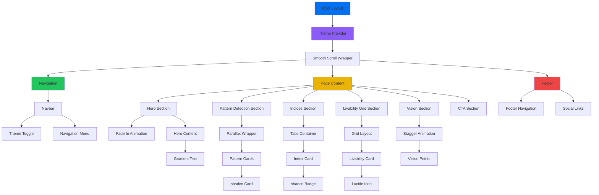
```mermaid
graph TD
    RootLayout[Root Layout]

    RootLayout --> ThemeProvider[Theme Provider]
    ThemeProvider --> SmoothScroll[Smooth Scroll Wrapper]
    SmoothScroll --> Navigation[Navigation]
    SmoothScroll --> PageContent[Page Content]
    SmoothScroll --> Footer[Footer]

    Navigation --> Navbar[Navbar]
    Navbar --> ThemeToggle[Theme Toggle]
    Navbar --> NavMenu[Navigation Menu]

    PageContent --> Hero[Hero Section]
    PageContent --> PatternDetection[Pattern Detection Section]
    PageContent --> Indices[Indices Section]
    PageContent --> Livability[Livability Grid Section]
    PageContent --> Vision[Vision Section]
    PageContent --> CTA[CTA Section]

    Hero --> HeroAnimation[Fade In Animation]
    Hero --> HeroContent[Hero Content]
    HeroContent --> GradientText[Gradient Text]

    PatternDetection --> ParallaxWrapper[Parallax Wrapper]
    ParallaxWrapper --> PatternCards[Pattern Cards]
    PatternCards --> Card[shadcn Card]

    Indices --> TabsContainer[Tabs Container]
    TabsContainer --> IndexCard[Index Card]
    IndexCard --> Badge[shadcn Badge]

    Livability --> GridLayout[Grid Layout]
    GridLayout --> LiveabilityCard[Livability Card]
    LiveabilityCard --> Icon[Lucide Icon]

    Vision --> StaggerAnimation[Stagger Animation]
    StaggerAnimation --> VisionPoints[Vision Points]

    Footer --> FooterNav[Footer Navigation]
    Footer --> SocialLinks[Social Links]

    style RootLayout fill:#0070f3
    style ThemeProvider fill:#8b5cf6
    style Navigation fill:#22c55e
    style PageContent fill:#eab308
    style Footer fill:#ef4444
```

### Component Categories

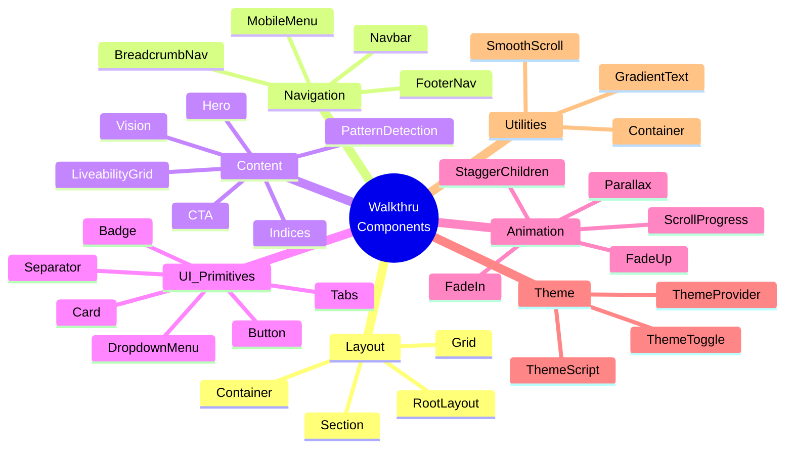
```mermaid
mindmap
  root((Walkthru<br/>Components))
    Layout
      RootLayout
      Container
      Section
      Grid
    Navigation
      Navbar
      MobileMenu
      FooterNav
      BreadcrumbNav
    Content
      Hero
      PatternDetection
      Indices
      LiveabilityGrid
      Vision
      CTA
    UI_Primitives
      Button
      Card
      Badge
      Separator
      Tabs
      DropdownMenu
    Animation
      FadeIn
      FadeUp
      Parallax
      ScrollProgress
      StaggerChildren
    Theme
      ThemeProvider
      ThemeToggle
      ThemeScript
    Utilities
      SmoothScroll
      GradientText
      Container
```

---

## Data Flow Architecture

### Client-Side State Flow

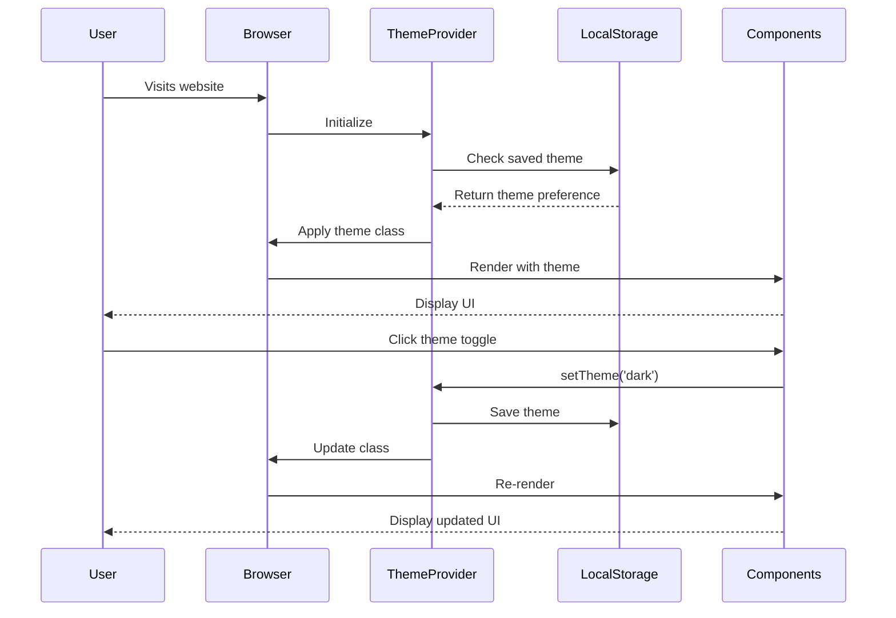
```mermaid
sequenceDiagram
    participant User
    participant Browser
    participant ThemeProvider
    participant LocalStorage
    participant Components

    User->>Browser: Visits website
    Browser->>ThemeProvider: Initialize
    ThemeProvider->>LocalStorage: Check saved theme
    LocalStorage-->>ThemeProvider: Return theme preference
    ThemeProvider->>Browser: Apply theme class
    Browser->>Components: Render with theme
    Components-->>User: Display UI

    User->>Components: Click theme toggle
    Components->>ThemeProvider: setTheme('dark')
    ThemeProvider->>LocalStorage: Save theme
    ThemeProvider->>Browser: Update class
    Browser->>Components: Re-render
    Components-->>User: Display updated UI
```

### Scroll Animation Flow

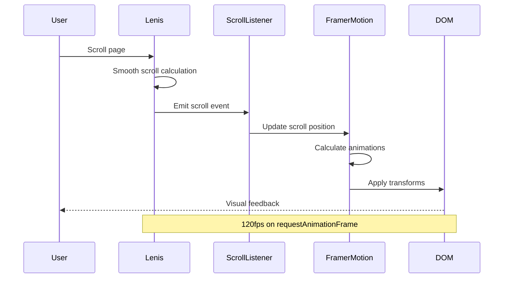
```mermaid
sequenceDiagram
    participant User
    participant Lenis
    participant ScrollListener
    participant FramerMotion
    participant DOM

    User->>Lenis: Scroll page
    Lenis->>Lenis: Smooth scroll calculation
    Lenis->>ScrollListener: Emit scroll event
    ScrollListener->>FramerMotion: Update scroll position
    FramerMotion->>FramerMotion: Calculate animations
    FramerMotion->>DOM: Apply transforms
    DOM-->>User: Visual feedback

    Note over Lenis,DOM: 120fps on requestAnimationFrame
```

### Page Load Sequence

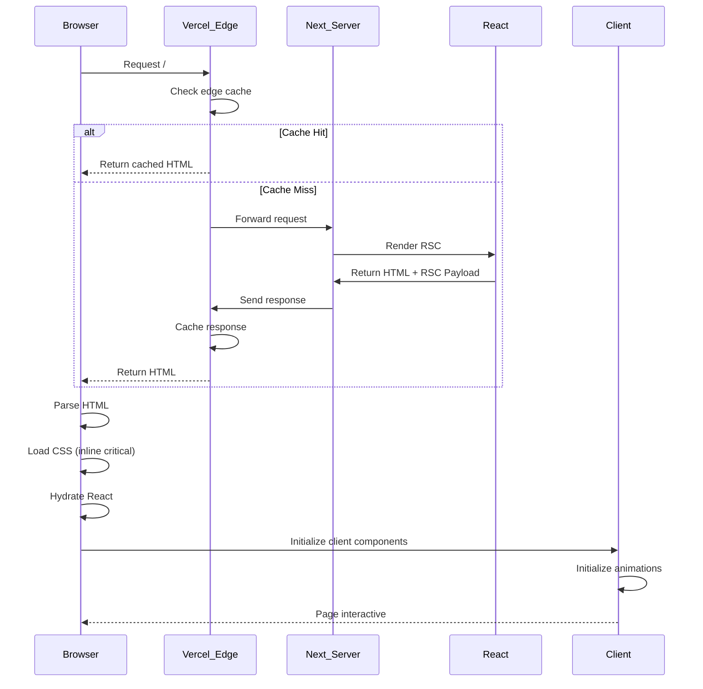
```mermaid
sequenceDiagram
    participant Browser
    participant Vercel_Edge
    participant Next_Server
    participant React
    participant Client

    Browser->>Vercel_Edge: Request /
    Vercel_Edge->>Vercel_Edge: Check edge cache

    alt Cache Hit
        Vercel_Edge-->>Browser: Return cached HTML
    else Cache Miss
        Vercel_Edge->>Next_Server: Forward request
        Next_Server->>React: Render RSC
        React->>Next_Server: Return HTML + RSC Payload
        Next_Server->>Vercel_Edge: Send response
        Vercel_Edge->>Vercel_Edge: Cache response
        Vercel_Edge-->>Browser: Return HTML
    end

    Browser->>Browser: Parse HTML
    Browser->>Browser: Load CSS (inline critical)
    Browser->>Browser: Hydrate React
    Browser->>Client: Initialize client components
    Client->>Client: Initialize animations
    Client-->>Browser: Page interactive
```

---

## Theme System Architecture

### Theme Provider Flow

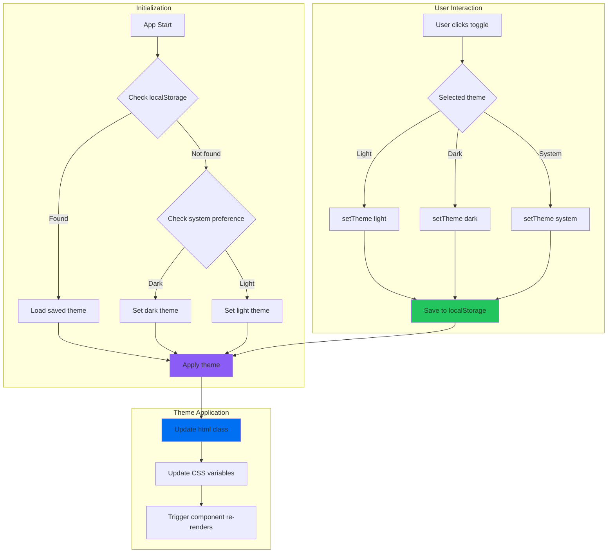
```mermaid
graph TB
    subgraph "Initialization"
        A[App Start] --> B{Check localStorage}
        B -->|Found| C[Load saved theme]
        B -->|Not found| D{Check system preference}
        D -->|Dark| E[Set dark theme]
        D -->|Light| F[Set light theme]
        C --> G[Apply theme]
        E --> G
        F --> G
    end

    subgraph "Theme Application"
        G --> H[Update html class]
        H --> I[Update CSS variables]
        I --> J[Trigger component re-renders]
    end

    subgraph "User Interaction"
        K[User clicks toggle] --> L{Selected theme}
        L -->|Light| M[setTheme light]
        L -->|Dark| N[setTheme dark]
        L -->|System| O[setTheme system]
        M --> P[Save to localStorage]
        N --> P
        O --> P
        P --> G
    end

    style G fill:#8b5cf6
    style H fill:#0070f3
    style P fill:#22c55e
```

### CSS Variable System

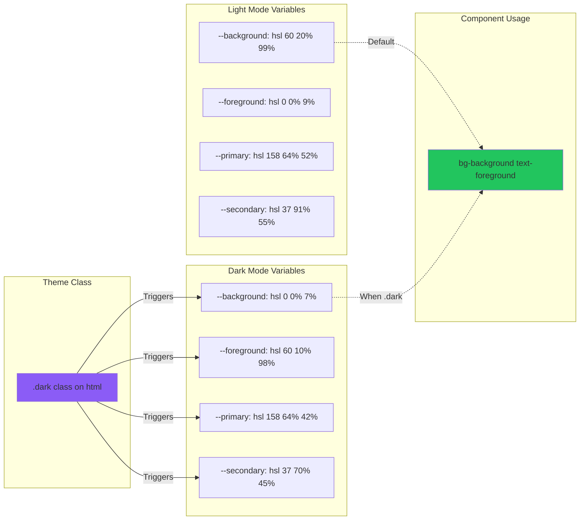
```mermaid
graph LR
    subgraph "Light Mode Variables"
        L1[--background: hsl 60 20% 99%]
        L2[--foreground: hsl 0 0% 9%]
        L3[--primary: hsl 158 64% 52%]
        L4[--secondary: hsl 37 91% 55%]
    end

    subgraph "Dark Mode Variables"
        D1[--background: hsl 0 0% 7%]
        D2[--foreground: hsl 60 10% 98%]
        D3[--primary: hsl 158 64% 42%]
        D4[--secondary: hsl 37 70% 45%]
    end

    subgraph "Theme Class"
        TC[.dark class on html]
    end

    subgraph "Component Usage"
        CU[bg-background text-foreground]
    end

    TC -->|Triggers| D1
    TC -->|Triggers| D2
    TC -->|Triggers| D3
    TC -->|Triggers| D4

    L1 -.->|Default| CU
    D1 -.->|When .dark| CU

    style TC fill:#8b5cf6
    style CU fill:#22c55e
```

---

## Animation Pipeline

### Scroll-Triggered Animations

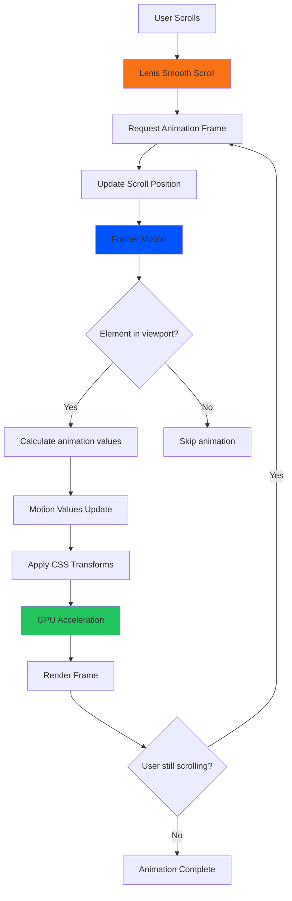
```mermaid
graph TD
    A[User Scrolls] --> B[Lenis Smooth Scroll]
    B --> C[Request Animation Frame]
    C --> D[Update Scroll Position]

    D --> E[Framer Motion]
    E --> F{Element in viewport?}

    F -->|Yes| G[Calculate animation values]
    F -->|No| H[Skip animation]

    G --> I[Motion Values Update]
    I --> J[Apply CSS Transforms]
    J --> K[GPU Acceleration]
    K --> L[Render Frame]

    L --> M{User still scrolling?}
    M -->|Yes| C
    M -->|No| N[Animation Complete]

    style B fill:#f97316
    style E fill:#0055ff
    style K fill:#22c55e
```

### Animation Variants System

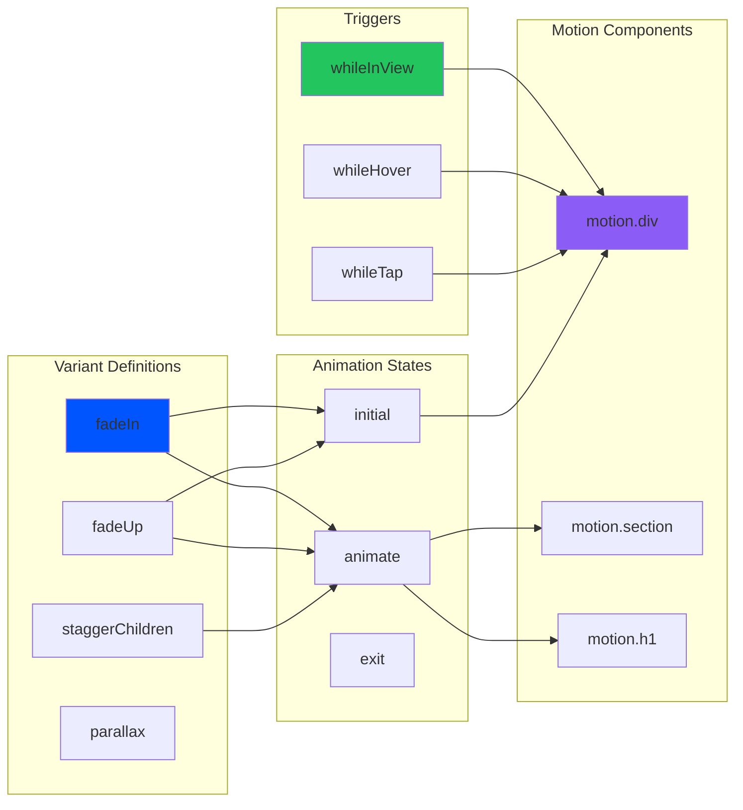
```mermaid
graph LR
    subgraph "Variant Definitions"
        V1[fadeIn]
        V2[fadeUp]
        V3[staggerChildren]
        V4[parallax]
    end

    subgraph "Animation States"
        S1[initial]
        S2[animate]
        S3[exit]
    end

    subgraph "Triggers"
        T1[whileInView]
        T2[whileHover]
        T3[whileTap]
    end

    subgraph "Motion Components"
        M1[motion.div]
        M2[motion.section]
        M3[motion.h1]
    end

    V1 --> S1
    V1 --> S2
    V2 --> S1
    V2 --> S2
    V3 --> S2

    T1 --> M1
    T2 --> M1
    T3 --> M1

    S1 --> M1
    S2 --> M2
    S2 --> M3

    style V1 fill:#0055ff
    style T1 fill:#22c55e
    style M1 fill:#8b5cf6
```

---

## Deployment Architecture

### Build and Deploy Pipeline

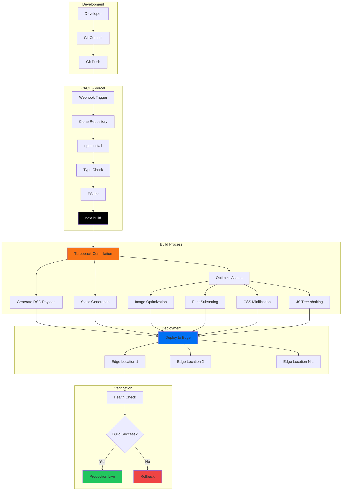
```mermaid
graph TB
    subgraph "Development"
        Dev[Developer] --> Git[Git Commit]
        Git --> Push[Git Push]
    end

    subgraph "CI/CD - Vercel"
        Push --> Trigger[Webhook Trigger]
        Trigger --> Clone[Clone Repository]
        Clone --> Install[npm install]
        Install --> TypeCheck[Type Check]
        TypeCheck --> Lint[ESLint]
        Lint --> Build[next build]
    end

    subgraph "Build Process"
        Build --> Turbopack[Turbopack Compilation]
        Turbopack --> RSC[Generate RSC Payload]
        Turbopack --> SSG[Static Generation]
        Turbopack --> Assets[Optimize Assets]

        Assets --> Images[Image Optimization]
        Assets --> Fonts[Font Subsetting]
        Assets --> CSS[CSS Minification]
        Assets --> JS[JS Tree-shaking]
    end

    subgraph "Deployment"
        RSC --> Deploy[Deploy to Edge]
        SSG --> Deploy
        Images --> Deploy
        Fonts --> Deploy
        CSS --> Deploy
        JS --> Deploy

        Deploy --> Edge1[Edge Location 1]
        Deploy --> Edge2[Edge Location 2]
        Deploy --> EdgeN[Edge Location N...]
    end

    subgraph "Verification"
        Edge1 --> Health[Health Check]
        Health --> Success{Build Success?}
        Success -->|Yes| Live[Production Live]
        Success -->|No| Rollback[Rollback]
    end

    style Build fill:#000000,color:#ffffff
    style Turbopack fill:#f97316
    style Deploy fill:#0070f3
    style Live fill:#22c55e
    style Rollback fill:#ef4444
```

### Edge Network Distribution

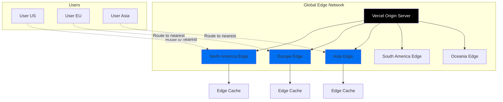
```mermaid
graph TB
    subgraph "Global Edge Network"
        Origin[Vercel Origin Server]

        NA[North America Edge]
        EU[Europe Edge]
        ASIA[Asia Edge]
        SA[South America Edge]
        OC[Oceania Edge]
    end

    subgraph "Users"
        U1[User US]
        U2[User EU]
        U3[User Asia]
    end

    Origin --> NA
    Origin --> EU
    Origin --> ASIA
    Origin --> SA
    Origin --> OC

    U1 -.->|Route to nearest| NA
    U2 -.->|Route to nearest| EU
    U3 -.->|Route to nearest| ASIA

    NA --> Cache1[Edge Cache]
    EU --> Cache2[Edge Cache]
    ASIA --> Cache3[Edge Cache]

    style Origin fill:#000000,color:#ffffff
    style NA fill:#0070f3
    style EU fill:#0070f3
    style ASIA fill:#0070f3
```

---

## Security Architecture

### Security Layers

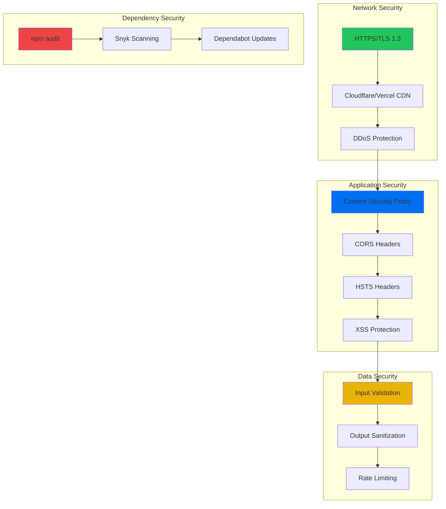
```mermaid
graph TD
    subgraph "Network Security"
        HTTPS[HTTPS/TLS 1.3]
        CDN[Cloudflare/Vercel CDN]
        DDoS[DDoS Protection]
    end

    subgraph "Application Security"
        CSP[Content Security Policy]
        CORS[CORS Headers]
        HSTS[HSTS Headers]
        XSS[XSS Protection]
    end

    subgraph "Data Security"
        Validation[Input Validation]
        Sanitization[Output Sanitization]
        RateLimit[Rate Limiting]
    end

    subgraph "Dependency Security"
        NPM[npm audit]
        Snyk[Snyk Scanning]
        Dependabot[Dependabot Updates]
    end

    HTTPS --> CDN
    CDN --> DDoS
    DDoS --> CSP

    CSP --> CORS
    CORS --> HSTS
    HSTS --> XSS

    XSS --> Validation
    Validation --> Sanitization
    Sanitization --> RateLimit

    NPM --> Snyk
    Snyk --> Dependabot

    style HTTPS fill:#22c55e
    style CSP fill:#0070f3
    style Validation fill:#eab308
    style NPM fill:#ef4444
```

### Authentication & Authorization Flow (Future)

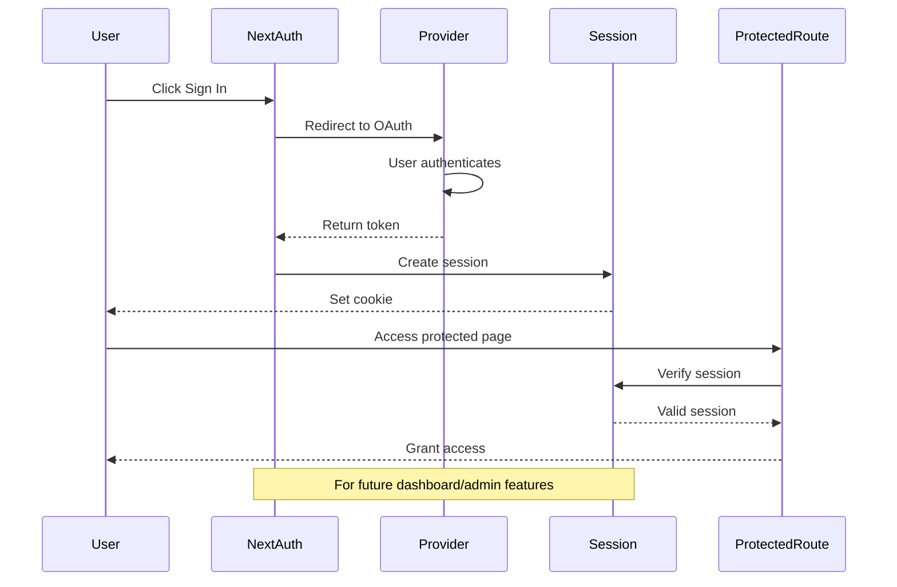
```mermaid
sequenceDiagram
    participant User
    participant NextAuth
    participant Provider
    participant Session
    participant ProtectedRoute

    User->>NextAuth: Click Sign In
    NextAuth->>Provider: Redirect to OAuth
    Provider->>Provider: User authenticates
    Provider-->>NextAuth: Return token
    NextAuth->>Session: Create session
    Session-->>User: Set cookie

    User->>ProtectedRoute: Access protected page
    ProtectedRoute->>Session: Verify session
    Session-->>ProtectedRoute: Valid session
    ProtectedRoute-->>User: Grant access

    Note over NextAuth,Session: For future dashboard/admin features
```

---

## Performance Optimization Architecture

### Rendering Strategy

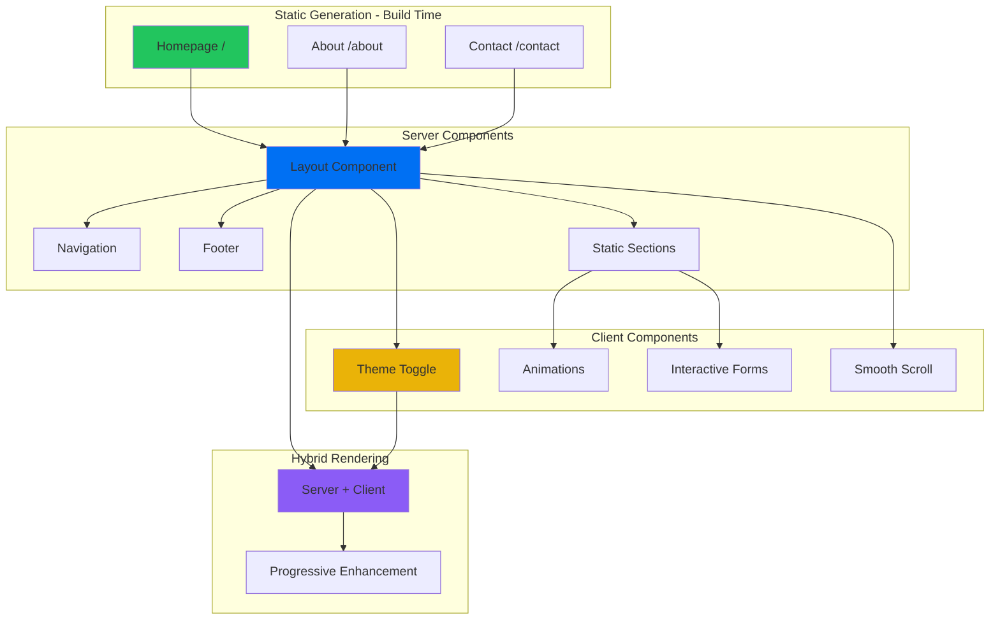
```mermaid
graph TB
    subgraph "Static Generation - Build Time"
        SG1[Homepage /]
        SG2[About /about]
        SG3[Contact /contact]
    end

    subgraph "Server Components"
        SC1[Layout Component]
        SC2[Navigation]
        SC3[Footer]
        SC4[Static Sections]
    end

    subgraph "Client Components"
        CC1[Theme Toggle]
        CC2[Animations]
        CC3[Interactive Forms]
        CC4[Smooth Scroll]
    end

    subgraph "Hybrid Rendering"
        H1[Server + Client]
        H2[Progressive Enhancement]
    end

    SG1 --> SC1
    SG2 --> SC1
    SG3 --> SC1

    SC1 --> SC2
    SC1 --> SC3
    SC1 --> SC4

    SC1 --> CC1
    SC4 --> CC2
    SC4 --> CC3
    SC1 --> CC4

    SC1 --> H1
    CC1 --> H1
    H1 --> H2

    style SG1 fill:#22c55e
    style SC1 fill:#0070f3
    style CC1 fill:#eab308
    style H1 fill:#8b5cf6
```

### Caching Strategy

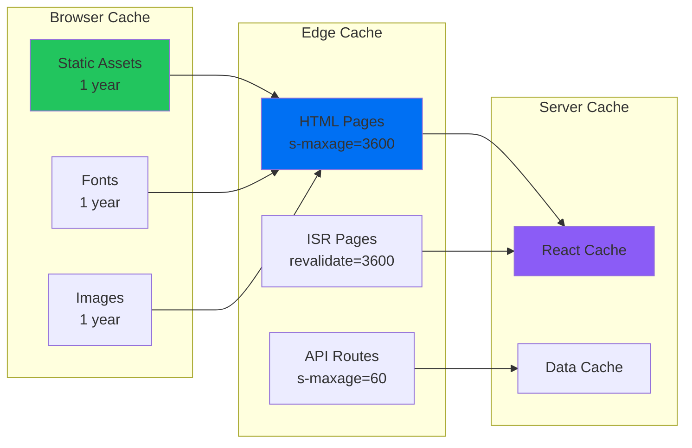
```mermaid
graph LR
    subgraph "Browser Cache"
        BC1[Static Assets<br/>1 year]
        BC2[Fonts<br/>1 year]
        BC3[Images<br/>1 year]
    end

    subgraph "Edge Cache"
        EC1[HTML Pages<br/>s-maxage=3600]
        EC2[API Routes<br/>s-maxage=60]
        EC3[ISR Pages<br/>revalidate=3600]
    end

    subgraph "Server Cache"
        SC1[React Cache]
        SC2[Data Cache]
    end

    BC1 --> EC1
    BC2 --> EC1
    BC3 --> EC1

    EC1 --> SC1
    EC2 --> SC2
    EC3 --> SC1

    style BC1 fill:#22c55e
    style EC1 fill:#0070f3
    style SC1 fill:#8b5cf6
```

---

## Monitoring & Analytics Architecture

### Observability Stack (Recommended)

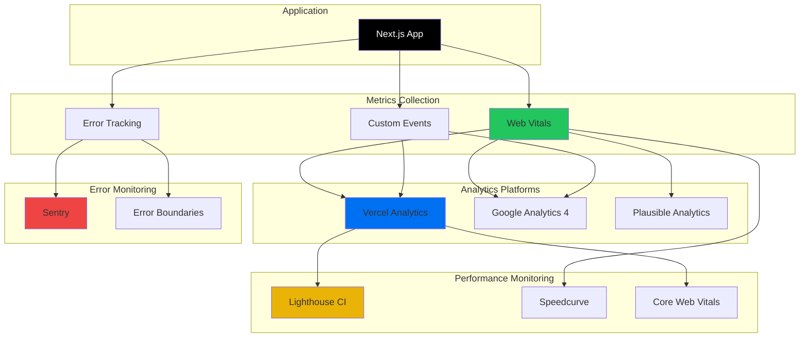
```mermaid
graph TB
    subgraph "Application"
        App[Next.js App]
    end

    subgraph "Metrics Collection"
        M1[Web Vitals]
        M2[Custom Events]
        M3[Error Tracking]
    end

    subgraph "Analytics Platforms"
        A1[Vercel Analytics]
        A2[Google Analytics 4]
        A3[Plausible Analytics]
    end

    subgraph "Error Monitoring"
        E1[Sentry]
        E2[Error Boundaries]
    end

    subgraph "Performance Monitoring"
        P1[Lighthouse CI]
        P2[Speedcurve]
        P3[Core Web Vitals]
    end

    App --> M1
    App --> M2
    App --> M3

    M1 --> A1
    M1 --> A2
    M1 --> A3

    M2 --> A1
    M2 --> A2

    M3 --> E1
    M3 --> E2

    A1 --> P1
    A1 --> P3
    M1 --> P2

    style App fill:#000000,color:#ffffff
    style M1 fill:#22c55e
    style A1 fill:#0070f3
    style E1 fill:#ef4444
    style P1 fill:#eab308
```

---

## Mobile-First Responsive Architecture

### Breakpoint Strategy

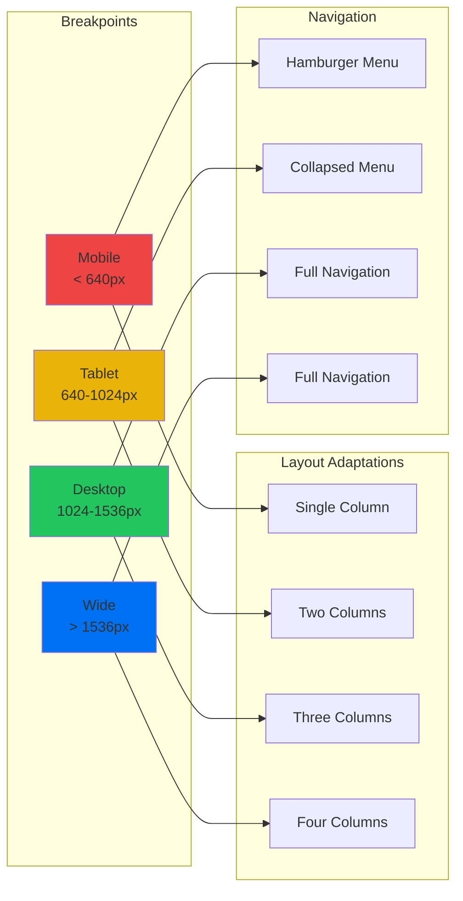
```mermaid
graph LR
    subgraph "Breakpoints"
        Mobile[Mobile<br/>< 640px]
        Tablet[Tablet<br/>640-1024px]
        Desktop[Desktop<br/>1024-1536px]
        Wide[Wide<br/>> 1536px]
    end

    subgraph "Layout Adaptations"
        L1[Single Column]
        L2[Two Columns]
        L3[Three Columns]
        L4[Four Columns]
    end

    subgraph "Navigation"
        N1[Hamburger Menu]
        N2[Collapsed Menu]
        N3[Full Navigation]
        N4[Full Navigation]
    end

    Mobile --> L1
    Tablet --> L2
    Desktop --> L3
    Wide --> L4

    Mobile --> N1
    Tablet --> N2
    Desktop --> N3
    Wide --> N4

    style Mobile fill:#ef4444
    style Tablet fill:#eab308
    style Desktop fill:#22c55e
    style Wide fill:#0070f3
```

---

## Summary

This architecture provides:

1. **Scalability** - Edge distribution, static generation, and efficient caching
2. **Performance** - Turbopack builds, optimized assets, lazy loading
3. **Maintainability** - Clear separation of concerns, modular components
4. **Security** - Multiple security layers, dependency scanning
5. **Developer Experience** - Fast refresh, TypeScript, clear structure
6. **User Experience** - Smooth animations, dark mode, responsive design

**Next:** See `implementation-plan.md` for step-by-step setup instructions.
