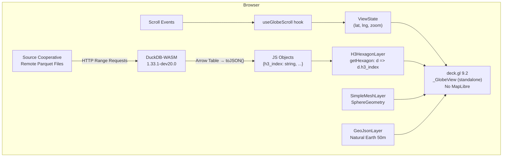
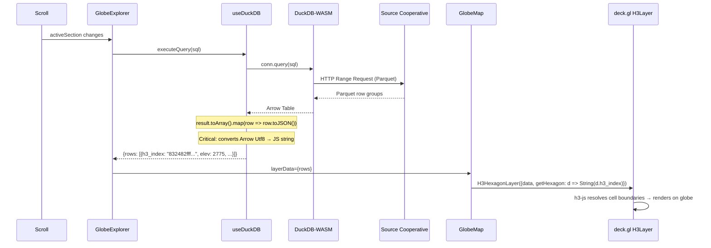
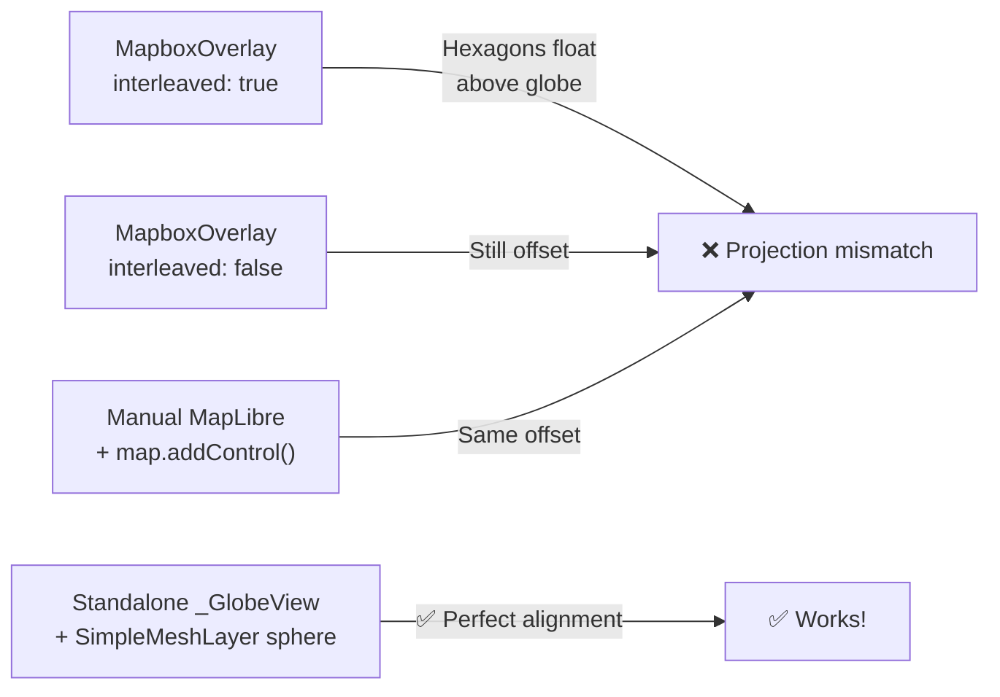

# Globe Explorer — Lessons Learned & Technical Reference

## Architecture



## Data Flow: DuckDB-WASM → deck.gl H3HexagonLayer



## Key Decisions & Why

### 1. Standalone deck.gl GlobeView (NO MapLibre)

**Problem**: deck.gl's `MapboxOverlay` (both interleaved and non-interleaved) has a **known projection matrix mismatch** with MapLibre's globe projection. H3 hexagons float above/offset from the globe surface.

**Root cause**: The `MapboxOverlay` globe support is listed as an **unchecked TODO** in deck.gl's GlobeView graduation tracker ([#9199](https://github.com/visgl/deck.gl/issues/9199)). Related bugs:
- [#9592](https://github.com/visgl/deck.gl/issues/9592) — Coordinate system mismatch (right-handed vs left-handed)
- [#9466](https://github.com/visgl/deck.gl/issues/9466) — Projection sync issues

**Approaches tried (all had offset issues)**:



**Final fix**: Remove MapLibre entirely. Use deck.gl's `_GlobeView` directly with:
- `SimpleMeshLayer` + `SphereGeometry` — ocean sphere background
- `GeoJsonLayer` — Natural Earth 50m land + country borders
- `H3HexagonLayer` — our data on top

This matches the pattern from:
- [deck.gl/examples/website/globe](https://github.com/visgl/deck.gl/tree/9.2-release/examples/website/globe) — React flight visualization
- [deck.gl/examples/get-started/scripting/globe](https://github.com/visgl/deck.gl/tree/master/examples/get-started/scripting/globe) — Vanilla JS globe
- [CodePen CARTO globe example](https://codepen.io/AdriSolid/pen/RwoQeeR) — CARTO + deck.gl globe

**Trade-off**: No MapLibre vector labels/tiles. Land masses rendered via GeoJSON (Natural Earth 50m).

**When to revisit**: When deck.gl completes GlobeView graduation ([#9199](https://github.com/visgl/deck.gl/issues/9199)). Then can switch back to MapLibre + MapboxOverlay for full vector tile basemaps with labels.

### 2. React Strict Mode disabled for deck.gl/luma.gl

**Problem**: React 19 Strict Mode double-invokes `useEffect` in development. The `DeckGL` component creates a WebGL device (luma.gl) in useEffect. The double invocation creates two WebGL devices — the second one crashes with:
```
Uncaught TypeError: can't access property "maxTextureDimension2D",
this.device.limits is undefined
```

**Root cause**: luma.gl 9.x `WebGLDevice` constructor triggers `_resizeObserver` which calls `getMaxDrawingBufferSize` before `device.limits` is fully populated. This happens when the second instance tries to initialize while the first is still being cleaned up.

**Fix**: Set `reactStrictMode: false` in `next.config.mjs`. This is safe because:
- The error only occurs in dev mode (production doesn't double-invoke)
- deck.gl/luma.gl don't support Strict Mode's double-invocation pattern
- The globe still renders correctly without Strict Mode

**Alternative (not used)**: Could also add `resolve.dedupe` for `@luma.gl/core` and `@deck.gl/core` in the build config (see objex `vite.config.ts`), but the root cause is Strict Mode, not package duplication.

### 3. H3 resolution 3 for all non-weather datasets

**Problem**: Higher resolution files are too large for browser-side DuckDB-WASM:

| Dataset | Res 3 | Res 4 | Res 5 |
|---------|-------|-------|-------|
| Terrain | 382 KB | 2.6 MB | — |
| Population | 968 KB | 5.6 MB | — |
| Building | 647 KB | 3.6 MB | 19.8 MB |
| Weather | — | — | ~44 MB/part |

**Fix**: Use res 3 files (all < 1 MB). Query completes in ~100ms in browser (after first load caches Parquet metadata).

**When to revisit**: Implement zoom-adaptive resolution — load higher res files when user zooms in.

### 4. Arrow-to-JS conversion with toJSON()

**Problem**: DuckDB-WASM returns Arrow tables. Arrow `Utf8` values are NOT plain JS strings — they're Arrow objects. deck.gl's `H3HexagonLayer` expects `getHexagon` to return a plain JS string.

**Symptom**: `typeof h3Value === 'object'` instead of `'string'`, causing H3HexagonLayer to silently fail (no hexagons rendered, no error).

**Fix**: Use the pattern from the objex codebase:
```typescript
const rows = result.toArray().map(row => row.toJSON());
```

This correctly converts all Arrow types to their JS equivalents. Always wrap with `String(d.h3_index)` in accessors as a safety net.

### 5. DuckDB-WASM worker blob pattern

**Problem**: DuckDB-WASM workers loaded from CDN fail with CORS errors in some browsers.

**Fix**: Fetch the worker script as a blob, create an object URL, and instantiate the Worker from that:
```typescript
const workerScript = await fetch(bundle.mainWorker!).then(r => r.blob());
const workerUrl = URL.createObjectURL(workerScript);
const worker = new Worker(workerUrl);
URL.revokeObjectURL(workerUrl);
```

### 6. Dark/Light theme support

The globe adapts to the site's `next-themes` system (`dark`/`light`/`system`):

| Element | Dark Mode | Light Mode |
|---------|-----------|------------|
| Background | `linear-gradient(#000, #112)` | `linear-gradient(#d4e6f1, #eaf2f8)` |
| Ocean sphere | `[10, 15, 30]` | `[160, 200, 230]` |
| Land fill | `[40, 80, 120]` opacity 0.15 | `[80, 140, 80]` opacity 0.3 |
| Borders | `[60, 100, 140, 120]` | `[100, 100, 100, 160]` |
| Ambient light | 0.6 | 1.0 |
| UI panels | `bg-black/60` | `bg-white/80` |

Uses `useTheme()` from `next-themes` with `resolvedTheme` (handles `system` → actual value).

### 7. MapLibre globe projection (NOT USED — documented for reference)

**How it works**: `react-map-gl/maplibre` properly converts `projection="globe"` (string) to `map.setProjection({ type: 'globe' })` (object). Verified in react-map-gl source — it checks `typeof projection === 'string'` and wraps in `{ type: projection }`.

**Note**: If using MapLibre directly (without react-map-gl), you MUST call `map.setProjection({ type: 'globe' })` inside the `map.on('load')` callback — calling it before the style loads throws `Error: Style is not done loading`.

**Why we don't use it**: deck.gl's MapboxOverlay doesn't properly sync with MapLibre's globe projection matrix. See decision #1 above.

## Known Bugs & Workarounds

### deck.gl + MapLibre Globe (reference — we bypass these by using standalone GlobeView)

| Issue | Status | Workaround |
|-------|--------|------------|
| [#9199](https://github.com/visgl/deck.gl/issues/9199) GlobeView graduation | Open — essential items unchecked | Use standalone `_GlobeView` instead of MapboxOverlay |
| [#9592](https://github.com/visgl/deck.gl/issues/9592) Depth/culling in interleaved | Open | `cullMode: 'front'`, `depthCompare: 'always'` |
| [#9466](https://github.com/visgl/deck.gl/issues/9466) Projection sync on toggle | Open | Change layer ID when projection changes |
| Coordinate system mismatch | Confirmed by maintainer | Right-handed vs left-handed; affects text, depth |

### deck.gl / luma.gl

| Issue | Workaround |
|-------|------------|
| `maxTextureDimension2D` crash in dev | Disable `reactStrictMode` in next.config.mjs |
| `_GlobeView` is experimental | Import as `_GlobeView` from `@deck.gl/core`. Works correctly. |

### DuckDB-WASM

| Issue | Workaround |
|-------|------------|
| `INSTALL` not supported in WASM | Use JS API `db.loadExtension('spatial')` then SQL `LOAD spatial;` |
| httpfs implicit in WASM | `read_parquet('https://...')` works out of the box, no `INSTALL httpfs` needed |
| Large Parquet files slow | Use smallest H3 resolution that's visually adequate; add WHERE lat/lon filters |
| Arrow Utf8 → JS string | Use `toArray().map(row => row.toJSON())` pattern |
| Init timeout risk | Wrap `db.instantiate()` in a timeout (30s); clear promise on failure for retry |

## S3 Bucket Structure

```
s3://us-west-2.opendata.source.coop/walkthru-earth/
├── dem-terrain/h3/
│   └── h3_res={1-10}/data.parquet
├── indices/
│   ├── population/scenario=SSP2/
│   │   └── h3_res={1-8}/data.parquet
│   ├── building/h3/
│   │   └── h3_res={3-8}/data.parquet
│   └── weather/model=GraphCast_GFS/
│       └── date={YYYY-MM-DD}/hour=0/h3_res=5/
│           └── part-{0-84}.parquet
```

**HTTPS proxy**: `https://data.source.coop/walkthru-earth/...`
**Direct S3**: `https://s3.us-west-2.amazonaws.com/us-west-2.opendata.source.coop/walkthru-earth/...`

Source Cooperative proxy is generally faster than direct S3 for browser queries (tested: terrain res 3 via proxy = 18s, via S3 = failed at 302s).

## Dependencies

| Package | Version | Purpose |
|---------|---------|---------|
| `deck.gl` | ^9.2.10 | Umbrella package |
| `@deck.gl/core` | ^9.2.10 | `_GlobeView`, `COORDINATE_SYSTEM`, `LightingEffect` |
| `@deck.gl/react` | ^9.2.10 | `DeckGL` React component |
| `@deck.gl/layers` | ^9.2.10 | `GeoJsonLayer` (land, borders) |
| `@deck.gl/mesh-layers` | ^9.2.10 | `SimpleMeshLayer` (earth sphere) |
| `@deck.gl/geo-layers` | ^9.2.10 | `H3HexagonLayer` |
| `@luma.gl/engine` | ^9.2.6 | `SphereGeometry` |
| `@duckdb/duckdb-wasm` | 1.33.1-dev20.0 | In-browser SQL engine |
| `next-themes` | ^0.4.6 | Dark/light theme support |
| `framer-motion` | ^12 | UI animations |

## File Manifest

| File | Purpose |
|------|---------|
| `app/indices/page.tsx` | Route — dynamic import of GlobeExplorer (SSR disabled) |
| `app/indices/layout.tsx` | SEO metadata |
| `components/globe/GlobeExplorer.tsx` | Main reusable component — orchestrates scroll, queries, layers |
| `components/globe/GlobeMap.tsx` | Standalone deck.gl `_GlobeView` globe rendering |
| `components/globe/ScrollSection.tsx` | Animated info panel per section (dark/light aware) |
| `components/globe/QueryPanel.tsx` | Floating collapsible SQL display with syntax highlighting (dark/light aware) |
| `components/globe/hooks/useGlobeScroll.ts` | Scroll progress → interpolated ViewState |
| `components/globe/hooks/useDuckDB.ts` | DuckDB-WASM singleton, query execution, Arrow→JS conversion |
| `components/globe/data/sections.ts` | Section configs (queries, view states, color scales) |
| `components/globe/utils/color-scales.ts` | Color interpolation utilities |
| `docs/globe-explorer-lessons.md` | This file |

## Future Improvements

- **Zoom-adaptive H3 resolution**: Load higher-res Parquet files as user zooms in (res 3 → 4 → 5)
- **GPS/IP geolocation**: Center globe on user's location on first load
- **Switch to MapLibre basemap**: When deck.gl completes GlobeView graduation ([#9199](https://github.com/visgl/deck.gl/issues/9199))
- **Dynamic weather date**: Auto-detect latest available weather date from S3
- **Reuse on `/hormones-cities`**: GlobeExplorer accepts custom `sections` prop
- **Add labels**: Natural Earth populated places as `TextLayer` on the globe

## References

- [deck.gl GlobeView API](https://deck.gl/docs/api-reference/core/globe-view) — Experimental globe projection
- [deck.gl GlobeView Source (9.2)](https://github.com/visgl/deck.gl/blob/9.2-release/modules/core/src/views/globe-view.ts)
- [deck.gl Globe Example (React)](https://github.com/visgl/deck.gl/tree/9.2-release/examples/website/globe) — Flight paths on globe
- [deck.gl Globe Example (Vanilla)](https://github.com/visgl/deck.gl/tree/master/examples/get-started/scripting/globe) — Simplest standalone globe
- [deck.gl Global Grids Example](https://github.com/visgl/deck.gl/tree/9.2-release/examples/website/global-grids) — H3/S2/Geohash on MapLibre globe (uses MapboxOverlay + interleaved)
- [CodePen: CARTO Globe](https://codepen.io/AdriSolid/pen/RwoQeeR) — deck.gl globe without MapLibre
- [deck.gl GlobeView Tracker #9199](https://github.com/visgl/deck.gl/issues/9199) — Must-watch for MapLibre integration
- [deck.gl MapLibre Globe Bug #9592](https://github.com/visgl/deck.gl/issues/9592)
- [deck.gl Globe Sync Bug #9466](https://github.com/visgl/deck.gl/issues/9466)
- [MapLibre GL v5 Globe Projection](https://maplibre.org/maplibre-style-spec/projection/)
- [react-map-gl MapLibre Integration](https://visgl.github.io/react-map-gl/docs/get-started/maplibre)
- [DuckDB-WASM Docs](https://duckdb.org/docs/api/wasm/overview)
- [H3 Hexagonal Spatial Index](https://h3geo.org/)
- [Source Cooperative — walkthru-earth](https://source.coop/walkthru-earth)
- [Natural Earth 50m GeoJSON](https://d2ad6b4ur7yvpq.cloudfront.net/naturalearth-3.3.0/) — Land + borders used for basemap
