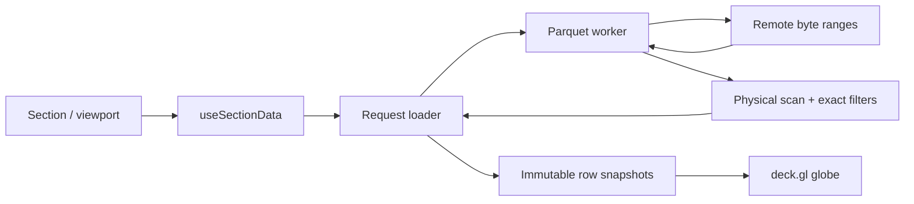

# Indices explorer

## Read and change the right layer

`app/indices/page.tsx` dynamically loads `GlobeExplorer` and reads share-link parameters (`section`, `z`, `x`, `y`, `h3`). `GlobeExplorer` coordinates navigation, viewport, resolution, panels, and timeline. `GlobeMap` renders deck.gl layers. The homepage links to this explorer and uses a data-free SVG cover.

Dataset configuration is split into weather, indices, and composites modules under `components/globe/data/`. `sections.ts` assembles the registry; `section-shared.ts` owns shared types, URL builders, and dataset helpers; `constants.ts` owns base URLs, view/query types, and percentile color ranges. A section's `loadData` performs JavaScript data operations, while `buildQuery` describes equivalent SQL for the query panel.

All indices Parquet downloads, including resolved weather partitions and composite sources, use `https://data.source.coop/walkthru-earth`. Partition discovery continues to use direct S3 ListObjectsV2 requests. Live weather and Overture discovery follows every S3 listing page before choosing the newest partition. Numeric hours and release revision suffixes compare numerically. Each page request has a 15-second timeout; concurrent discovery calls share work, successful results expire after five minutes, and failures can retry. See the [S3 ListObjectsV2 API](https://docs.aws.amazon.com/AmazonS3/latest/API/API_ListObjectsV2.html) for the continuation-token contract.

The [scoped agent guide](../components/globe/AGENTS.md) maps individual changes to files.

## On-demand data flow

1. Viewport and section state select an H3 resolution within the dataset's supported range. Automatic resolution and bounds commit together after 400 ms without camera changes, rather than reloading geometry at each zoom threshold during a gesture. Manual resolution changes override the automatic zoom choice.
2. Debounced geographic bounds become merged H3 ranges in `h3-viewport.ts`. The cover starts at the data resolution and coarsens until it fits a 1,024-cell predicate budget; overlapping bounding boxes conservatively include visible descendants. Whole-globe views can omit spatial filtering. At resolution 3 and above, the explorer waits for initial viewport bounds before starting a request to avoid an initial unbounded scan.
3. `useSectionData` resolves only live partitions referenced by the active section, then passes the viewport and an AbortSignal through its source loads. It does not prefetch unrelated sections.
4. `parquet-loader.ts` sends the selected columns and filters to the module worker. Its completed-result cache includes URL, columns, H3 ranges, and numeric filter in the key.
5. `parquet-worker.ts` opens an HTTP range-backed `AsyncBuffer`, reads/caches metadata, and calls `scanParquet`.
6. `parquet-scan.ts` plans retained physical row ranges with `parquetScan`, reads aligned columns, applies exact filters, and emits matching row batches.
7. The loader accumulates batches and throttles immutable partial snapshots. React computes the color range and deck.gl updates the active data layer. Forecast time buckets are built once per row response so playback selects a bucket instead of repeatedly scanning the whole forecast.

## Scan correctness

The installed hyparquet integration uses `parquetScan({ columns, pruningFilter, usePageIndex: true, ... })` followed by `scan.readColumn` over the same `rowStart`/`rowEnd` for every requested column. Retained ranges represent physical file positions; arrival order is not a row identity. See [hyparquet scan source](https://github.com/hyparam/hyparquet/blob/master/src/scan.js) and the installed package types when upgrading.

H3 interval predicates prune INT64 statistics when that physical type is present. Numeric predicates combine with spatial predicates. Pruning can retain extra rows, so the worker still applies an exact H3 keep mask and numeric comparison before constructing output objects. String H3 datasets use the exact mask without applying numeric H3 predicates to string statistics. Keep H3 values as `bigint` until converting to hex for `H3HexagonLayer`.

Requested columns are projected; filter columns are included for evaluation even if not selected for output. Each candidate range is decoded once per selected column, then delivered in 16,384-row application batches with cancellation checks and event-loop yields. This avoids repeatedly decoding the same column chunk when a file has no page indexes. Physical page or column-chunk decoding can still require more data than one application batch.

## Cancellation and caches

A section/viewport effect owns an AbortController. Replacing or unmounting it aborts the loader request; the worker aborts fetches and checks the signal between decoding batches. Cancellation rejects rather than returning an incomplete successful result. Completed results alone enter the cache; stale callbacks cannot update the current section. Rendered rows, metadata, and context belong to the current section, resolution, and H3 ranges. Changing that identity immediately hides the previous response, before effect cleanup, so coarse cells cannot remain behind a new progressive load.

| Cache                         | Current budget                        | Scope              |
| ----------------------------- | ------------------------------------- | ------------------ |
| Completed loader results      | 200,000 total rows, at most 6 entries | Full request key   |
| Worker compressed byte ranges | 64 MiB, at most 256 entries           | URL and byte range |
| Worker Parquet metadata       | 16 entries                            | URL                |
| Worker known file sizes       | 32 entries                            | URL                |

The shared implementation is `lib/lru-cache.ts`. The result budget is a row count, not a measured byte allocation. These budgets limit retained cache entries, not total active rows, temporary decoded buffers, composite joins, structured-clone overhead, or GPU allocations. Versioned/immutable dataset URLs are expected; a changed object at the same URL can outlive its cached metadata during a session.

## Rendering

`GlobeMap` uses standalone `_GlobeView`, a sphere background, satellite `TileLayer`/`BitmapLayer`, local land and border GeoJSON, and `H3HexagonLayer`. MapLibre is used separately by CapyBrain.

Layers draw in sphere, satellite, land, borders, H3, and location-pin order. Sphere and H3 depth writes remain enabled for backside hiding and column occlusion. The translucent satellite, land, and borders retain depth testing but do not write depth, so differently tessellated basemap surfaces cannot hide H3 fills. Satellite images explicitly use Web Mercator texture coordinates, including on the globe. The Cartesian sphere is excluded from both drawing and picking in the Mercator viewport above zoom 12.

H3 cells use full coverage with no separate flat-cell stroke layer. Extrusion preserves relative column heights but limits the tallest column to 20% of the actual camera altitude, preventing fixed exaggeration from putting the camera inside tall cells at close zoom. Tooltip values remain the source values. Hovering reuses the memoized H3 sequence comparison instead of traversing every cell for each pointer movement.

Keep `highPrecision: true` for the H3 layer on the globe: the alternative instanced approximation is not a safe substitute for curved geometry. The [GlobeView API](https://deck.gl/docs/api-reference/core/globe-view) still describes this view as experimental; check its supported behavior when upgrading.

The pinned deck.gl 9.4.0 package has a small pnpm patch in `patches/`: `GlobeView` switches to `WebMercatorViewport` above zoom 12, but its controller calls the globe-only `getZoomAnchorStrength` method during anchored zoom. The patch retains the spherical calculation for globe viewports and uses `panByPosition` for Mercator viewports. It covers the source and exported ESM/CJS variants. Regression tests drive the real controller across the projection boundary and check pointer-anchor stability and zoom constraints. When upgrading deck.gl, check whether upstream fixes this path, remove the version-specific patch if appropriate, and rerun both controller and browser zoom checks. Do not hide this error by disabling wheel zoom or reducing the zoom range.

The render device pixel ratio is capped at 2. Base layers and data layers have separate memoization. The H3 ID array retains its identity when forecast steps contain the same cell sequence, so only color and elevation attributes change. Static location rings avoid a permanent React animation loop. Stable data references avoid unnecessary geometry rebuilds; accessor dependencies belong in `updateTriggers`. Partial results intentionally create new immutable arrays at a throttled cadence. Relevant upstream references are [H3HexagonLayer](https://deck.gl/docs/api-reference/geo-layers/h3-hexagon-layer) and [deck.gl performance guidance](https://deck.gl/docs/developer-guide/performance).

## Adding a dataset

Add a `GlobeSection` in the appropriate domain module and its ID in `data/section-ids.ts`, which determines narrative order without pulling the dataset implementations into the initial route bundle. Declare the supported resolution range, source links, selected columns, color/elevation accessors, tooltip, legend, and description. Keep `buildQuery` consistent with the actual load and formula; live partition dependency discovery uses its weather/Overture placeholders.

Pass `ctx.signal` and `ctx.h3Ranges` to every `loadParquet` call, including all sides of joins. Join H3 datasets at the same resolution and preserve exact integer keys. Derived formulas must handle missing values and division by zero. Test real schema assumptions rather than copying a historic path or column name.

## Verification and honest performance reporting

Run `pnpm test`, `pnpm type-check`, `pnpm lint`, and `pnpm build` for pipeline changes. Regression tests should exercise filters, physical row alignment, bounded cache eviction, cancellation, and failures; use browser checks for WebGL and real HTTP behavior.

For `/indices`, check a cold initial visit, terrain/population independent of live weather discovery, a weather timeline, and a composite section. Zoom from the whole globe to a city, pan across the antimeridian, change resolution, switch sections during a load, and navigate away mid-load. Confirm older requests stop and their data cannot replace the active section. Check tooltips, layers, share links, desktop/mobile, and both themes.

For a performance comparison, record the exact dataset URL and resolution, viewport, browser/device, network throttling, cache state, transferred bytes, request count, time to first visible cells, time to completion, and long tasks/frame responsiveness. Compare the same conditions before and after. Do not report a speedup based solely on a smaller source file, changed API, or passing build.

Actual transfer savings depend on file layout. A large single row group without page indexes can still require reading broad column chunks even for a small viewport. High-precision geometry and composite processing can dominate after network/decode improvements. See [producer guidance](parquet-producer-guidance.md) for changes that require upstream data work.

## Validation recorded 2026-09-10

The upgrade was checked with a frozen pnpm 12.3.4 install, peer/outdated checks, Oxlint, TypeScript, 79 regression tests, formatting, and the complete Next.js static build. Production Chromium smoke checks covered all public routes without page errors, plus a 390×844 mobile indices view without horizontal overflow.

Live GraphCast `date=2026-09-09/hour=12`, H3 resolution 1, returned 17,682 rows across 21 forecast steps. Only weather partition listings and projected Parquet range requests were observed for that initial view. A terrain deep link (`z=4`, `y=30`, `x=30`, H3 resolution 3) rendered 3,293 filtered cells without weather/Overture discovery. The housing-pressure composite loaded building and population sources and rendered 3,522 joined cells in the same regional view. Playback pause, keyboard timeline stepping, dark mode, satellite visibility, and hover tooltips passed interaction checks. All three views rendered using Chromium software WebGL. These are correctness smoke checks, not a before/after timing benchmark or proof of performance at every resolution.

Hardware-GPU and Safari performance remain unmeasured. Software WebGL can emit driver/reflection diagnostics, and the alternate Chrome software mode stalled during testing; Chromium's `swiftshader-webgl` mode completed. Source row-group size, missing page indexes, high-resolution polygon geometry, and main-thread composite joins still limit throughput.

### Zoom regression follow-up

The unpatched production export reproduced `getZoomAnchorStrength is not a function` during wheel zoom past zoom 12. With the version-specific patch, all 85 tests and the production build pass. Isolated Chromium software WebGL checks against both Next.js development and the production export zoomed from 11.9 to 17.1, back across 12, and panned without page errors. This checks the reported interaction failure; it does not establish high-resolution data-loading throughput or hardware-GPU performance.

## Rendering and request follow-up, 2026-10-07

The request-isolation, adaptive-cover, and extrusion changes pass 163 tests,
Oxlint, TypeScript, formatting, and the production static build. New regressions
exercise resolution/viewport replacement, late cancelled responses, conservative
fine-resolution coverage, and extrusion limits using real deck.gl viewports at
desktop/mobile sizes, poles, pitch, and the globe/Mercator boundary.

Firefox 157 desktop checks against the production export covered terrain at
zoom 4/H3 resolution 3, wheel zoom through resolutions 4 and 5, cell tooltips,
and satellite/land/border visibility controls. The resolution-5 replacement
showed the satellite basemap without previous-resolution cells during loading.
Uniform artificial coverage gaps were absent. Further close-zoom and mobile
interaction checks were interrupted by concurrent browser use. These are
correctness observations, not an FPS or loading-speed benchmark; large physical
Parquet ranges and cumulative polygon rebuilding remain performance limits.

A same-machine curl comparison of terrain resolution 5 used six concurrent,
disjoint 1 MiB ranges against direct S3 and `data.source.coop`, with two trials
in reversed endpoint order and no client response cache. S3 negotiated HTTP/1.1
and completed in 4.99/9.08 seconds; the proxy negotiated HTTP/2 and completed in
6.16/4.87 seconds. A separate 4 MiB range completed in 4.55/3.93 seconds
respectively. All responses were complete HTTP 206 responses with matching
SHA-256 hashes between endpoints. The proxy advertised HTTP/3, which this curl
build could not test, and its HEAD response reported `cf-cache-status: DYNAMIC`.
This small, variable network sample does not establish Firefox page-loading
performance. The dataset download URLs were subsequently switched to the proxy
at the user's request; partition discovery retains direct S3 listings. The
switch passes 170 tests, lint, type checking, formatting, and the production
static build. URL regressions cover every dataset builder and resolved weather
partitions. Firefox verification of the switched production export was
interrupted by concurrent browser use.
